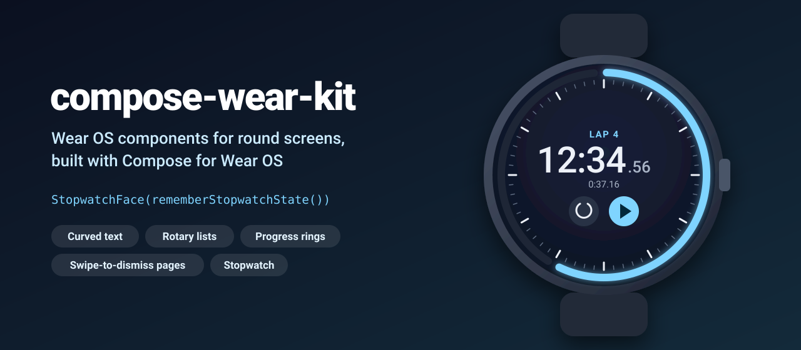
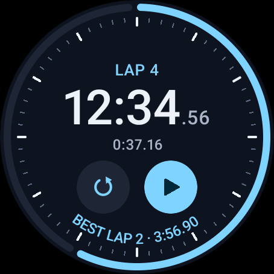
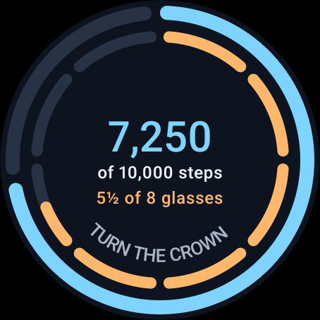
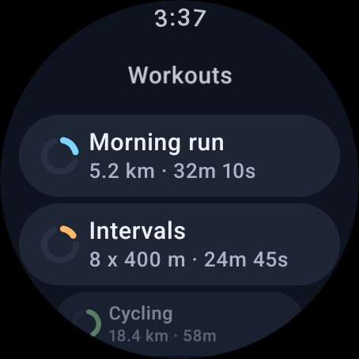
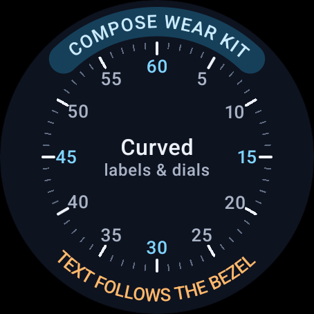

<p align="center">
  
</p>

<p align="center">
  <a href="https://github.com/halilozel1903/compose-wear-kit/actions/workflows/ci.yml"></a>
  <a href="https://jitpack.io/#halilozel1903/compose-wear-kit"></a>
  
  
  
  
  <a href="LICENSE"></a>
</p>

**compose-wear-kit** is a set of Wear OS components for round screens, built on Compose for Wear OS and its Material 3 library: text that follows the bezel and stays upright at the bottom, lists that scroll or snap with the crown, progress rings and segmented rings with real gaps between round caps, swipe-to-dismiss pages, and a complete stopwatch face with laps. The math behind them (a stopwatch and countdown state machine, arc and segment layout, rotary step accumulation, curved text angles and duration formatting) lives in a plain Kotlin module with unit tests.

```kotlin
val stopwatch = rememberStopwatchState()

AppScaffold {
    ScreenScaffold(timeText = {}) {
        StopwatchFace(stopwatch)   // seconds ring, ticks, 12:34.56, lap and start/pause buttons
    }
}
```

## Screenshots

Captured from the sample app on a Wear OS emulator (large round, 454 x 454) by CI.

| Stopwatch | Rings | Rotary list | Curved text |
| :---: | :---: | :---: | :---: |
|  |  |  |  |

## Why

Compose for Wear OS gives you `CurvedLayout`, `TransformingLazyColumn`, rotary modifiers and pagers, but a real watch app still has to solve the same small problems again: text on the bottom bezel comes out upside down unless you flip its direction, round stroke caps eat the gaps between ring segments, crown events arrive as a stream of tiny pixel deltas that have to become "one step", and a stopwatch needs laps, pausing, saving and a display that updates without drift. compose-wear-kit packs those answers into small components and keeps the logic in `compose-wear-kit-core`, a pure Kotlin module with 48 unit tests that run on any JVM.

## Features

- **`CurvedLabel(text, position)`**: text along the bezel at the top, bottom, left or right. Bottom text runs counter clockwise so it reads upright. Optional pill background, inset (to clear a ring) and an ellipsis past a maximum sweep.
- **`DialLabels` and `DialTicks`**: upright numbers spread around the dial and minute/hour tick marks, for stopwatch and timer bezels.
- **`RotaryList`**: a Material 3 `TransformingLazyColumn` that scrolls with the crown, smoothly (`RotaryMode.Scroll`) or one item per detent (`RotaryMode.Snap`), with haptics. `RotaryScalingList` does the same on a `ScalingLazyColumn`.
- **`Modifier.rotarySteps`**: crown rotation as whole steps for anything that is not a list (pickers, values, rings). Remainders carry over, and a pause or a change of direction drops them so there are no stray steps.
- **`ProgressRing(progress)`**: a ring along the edge of the screen with a gap between the indicator and the track, round caps, an optional open arc (`startAngle`, `sweepAngle`), animation and content in the middle.
- **`SegmentedRing`**: equal segments filled up to a progress (`segmentCount`, `progress`) or each with its own fill (`segmentFills`), with per segment colors. Gaps are measured in dp and stay the same size at any radius.
- **`SwipeDismissPages(pageCount, onDismiss)`**: horizontal pages with a page indicator; swiping right on the first page dismisses the stack, later pages swipe back as usual.
- **`StopwatchFace(state)`** and **`rememberStopwatchState()`**: a complete stopwatch screen: seconds ring, ticks, minutes and seconds with hundredths, current lap, lap/reset and start/pause buttons, the best lap curved along the bottom. The state ticks only while running and survives process death (it is based on `SystemClock.elapsedRealtime`).
- **Bring your own theme**: everything reads `androidx.wear.compose.material3.MaterialTheme`, and colors, sizes and texts can be overridden (`StopwatchFaceLabels` for translations).
- **No icon dependency**: play, pause, lap and reset icons are drawn (`WearKitIconImage`).
- **Pure Kotlin core** (`compose-wear-kit-core`): `Stopwatch`, `CountdownTimer`, their controllers with a `ManualClock` for tests, `RingMath`, `RotaryStepAccumulator`, `RotarySnap`, `CurvedTextLayout` and `DurationFormat`.

## Installation

Add JitPack to `settings.gradle.kts`:

```kotlin
dependencyResolutionManagement {
    repositories {
        google()
        mavenCentral()
        maven("https://jitpack.io")
    }
}
```

Then the dependency:

```kotlin
dependencies {
    implementation("com.github.halilozel1903.compose-wear-kit:compose-wear-kit:1.0.0")
    // Pure Kotlin stopwatch, ring, rotary and text math only (for JVM/KMP modules):
    // implementation("com.github.halilozel1903.compose-wear-kit:compose-wear-kit-core:1.0.0")
}
```

The library brings `androidx.wear.compose:compose-material3` and `compose-foundation` 1.6.1 as `api` dependencies and needs `minSdk` 30 (Wear OS 3). Your app's manifest should declare it is a watch app:

```xml
<uses-feature android:name="android.hardware.type.watch" />

<application android:theme="@android:style/Theme.DeviceDefault" ...>
    <meta-data
        android:name="com.google.android.wearable.standalone"
        android:value="true" />
    ...
</application>
```

> The build is also set up for Maven Central (`io.github.halilozel1903:compose-wear-kit`) via the vanniktech publish plugin.

## Usage

Wrap your app in the Wear Material 3 theme and `AppScaffold`, and each screen in a `ScreenScaffold`, so the background, the time at the top and the scroll indicator follow the theme.

**Stopwatch**

```kotlin
@Composable
fun StopwatchScreen() {
    val stopwatch = rememberStopwatchState()
    ScreenScaffold(timeText = {}) {           // the seconds ring takes the edge, so hide the clock
        StopwatchFace(
            state = stopwatch,
            labels = StopwatchFaceLabels(title = stringResource(R.string.stopwatch)),
        )
    }
}

// Or build your own face from the state:
Text(DurationFormat.stopwatch(stopwatch.elapsedMillis))   // "12:34.56"
Button(onClick = stopwatch::lap) { Text("Lap") }
stopwatch.laps                                            // List<Lap>(number, lapMillis, totalMillis)
stopwatch.stopwatch.fastestLap
```

**Curved text**

```kotlin
Box(Modifier.fillMaxSize()) {
    CurvedLabel("WORKOUT", background = MaterialTheme.colorScheme.primaryContainer)
    CurvedLabel("TURN THE CROWN", position = BezelPosition.Bottom, inset = 20.dp)  // upright
    DialTicks(Modifier.padding(24.dp))
    DialLabels((0 until 12).map { if (it == 0) "60" else "${it * 5}" }, Modifier.padding(24.dp))
}
```

**Rotary list**

```kotlin
val listState = rememberTransformingLazyColumnState()
val spec = rememberTransformationSpec()
ScreenScaffold(scrollState = listState) { padding ->
    RotaryList(state = listState, contentPadding = padding, rotaryMode = RotaryMode.Snap) {
        items(workouts) { workout ->
            Button(
                onClick = { open(workout) },
                modifier = Modifier.fillMaxWidth().transformedHeight(this, spec),
                transformation = SurfaceTransformation(spec),
                label = { Text(workout.name) },
                secondaryLabel = { Text(DurationFormat.compact(workout.durationMillis)) },  // "32m 10s"
            )
        }
    }
}
```

**Crown steps for anything else**

```kotlin
var minutes by remember { mutableIntStateOf(5) }
val focusRequester = remember { FocusRequester() }
val accumulator = rememberRotaryStepAccumulator(stepPixels = 48f)

Box(
    Modifier.fillMaxSize().rotarySteps(accumulator, focusRequester) { steps ->
        minutes = RotarySnap.stepValue(minutes, steps, min = 1, max = 60)
    },
) { ProgressRing(progress = minutes / 60f) { Text("$minutes min") } }

LaunchedEffect(Unit) { focusRequester.requestFocus() }
```

**Rings**

```kotlin
ProgressRing(progress = steps / 10_000f, modifier = Modifier.fillMaxSize().padding(4.dp)) {
    Text("7,250 steps")
}

SegmentedRing(segmentCount = 8, progress = glasses / 8f, gap = 5.dp)

SegmentedRing(
    segmentFills = listOf(1f, 1f, 0.4f, 1f, 1f, 0f, 0f),   // one segment per day
    segmentColor = { day -> if (day == today) Color.Yellow else MaterialTheme.colorScheme.tertiary },
)

ProgressRing(progress = 0.6f, startAngle = 135f, sweepAngle = 270f)  // an open gauge
```

**Pages**

```kotlin
SwipeDismissPages(pageCount = 3, onDismiss = { navigateBack() }) { page ->
    ScreenScaffold(timeText = {}) {
        when (page) {
            0 -> HeartRatePage()
            1 -> StepsPage()
            else -> SummaryPage()
        }
    }
}
```

## API

| Component | What it does |
| --- | --- |
| `CurvedLabel(text, position, color, fontSize, background, inset, maxSweepDegrees)` | Text on the bezel, upright at the bottom |
| `DialLabels(labels, inset, highlighted)` / `DialTicks(count, majorEvery)` | Dial numbers and tick marks |
| `RotaryList(state, rotaryMode, contentPadding)` / `RotaryScalingList(...)` | Crown scrolling lists (`TransformingLazyColumn` / `ScalingLazyColumn`) |
| `Modifier.rotarySteps(accumulator, focusRequester, onSteps)` | Crown rotation as whole steps |
| `ProgressRing(progress, color, trackColor, strokeWidth, gap, startAngle, sweepAngle)` | Progress around the edge |
| `SegmentedRing(segmentCount, progress)` / `SegmentedRing(segmentFills)` | Segmented progress |
| `SwipeDismissPages(pageCount, onDismiss, pagerState, dismissEnabled)` | Pages with swipe-to-dismiss on the first page |
| `StopwatchFace(state, colors, labels, showTicks)` / `StopwatchButtons(state)` | Stopwatch screen and its buttons |
| `rememberStopwatchState(initial, clock)` | Saveable, ticking stopwatch state: `start()`, `pause()`, `toggle()`, `lap()`, `reset()`, `elapsedMillis`, `laps` |

| Core | What it does |
| --- | --- |
| `Stopwatch.start(now) / pause(now) / lap(now) / reset()` | Immutable stopwatch: `elapsedAt(now)`, `currentLapAt(now)`, `fastestLap`, `slowestLap` |
| `CountdownTimer(durationMillis)` | `remainingAt(now)`, `fractionRemainingAt(now)`, `isFinishedAt(now)`, `plus(millis, now)` |
| `StopwatchController(clock)` / `CountdownController(clock, timer)` | Mutable wrappers that read a `WearClock`; `ManualClock` for tests |
| `RingMath.progressArcs / segments / segmentFills / degreesForLength / capDegrees` | Arc sweeps, gaps and round cap compensation |
| `RotaryStepAccumulator(stepPixels).accumulate(delta, time)` | Pixel deltas to whole steps |
| `RotarySnap.stepIndex / nearestIndex / stepValue` | Clamped or wrapping snapping for lists and pickers |
| `CurvedTextLayout.glyphAngles / sweepDegrees / ellipsize / evenAngles / pointAt / dialDegrees` | Angles for text and labels on a circle |
| `DurationFormat.stopwatch / clock / countdown / compact / delta` | `"12:34.56"`, `"1:02:03"`, `"5:00"` (rounded up), `"1h 5m"`, `"+0:01.20"` |

```kotlin
val clock = ManualClock()
val controller = StopwatchController(clock)
controller.start()
clock.advanceBy(41_200)
controller.lap()
controller.laps            // [Lap(number = 1, lapMillis = 41200, totalMillis = 41200)]

RingMath.segments(count = 4, gapDegrees = 10f)      // four 80 degree arcs, a gap at 12 o'clock
RingMath.progressArcs(progress = 0.25f, gapDegrees = 4f)
// indicator -90..0, track 4..266: a gap on both sides of the indicator
```

## Sample app

The `sample` module is a standalone Wear OS app with a menu of five demos: the stopwatch, rings (turn the crown to change the steps), a rotary workout list, curved text and swipe-to-dismiss pages. Swipe right (or press back) to return to the menu.

Taps and crown turns can't be timed reliably through adb on a fresh emulator, so the sample opens a demo with fixed data from an intent extra (used by `scripts/screenshots.sh`):

```bash
./gradlew :sample:installDebug
adb shell am start -n io.github.halilozel1903.wearkit.sample/.MainActivity --es scene stopwatch
```

`scene` is one of `stopwatch` (paused at 12:34.56 with three laps), `rings`, `list` or `curved`.

## Project structure

| Module | What it is |
| --- | --- |
| `wearkit-core` | Pure Kotlin: stopwatch and countdown state machines, ring math, rotary steps and snapping, curved text angles, duration formatting. Published as `compose-wear-kit-core` |
| `wearkit` | Compose for Wear OS: `CurvedLabel`, `DialLabels`, `DialTicks`, `RotaryList`, `ProgressRing`, `SegmentedRing`, `SwipeDismissPages`, `StopwatchFace`. Published as `compose-wear-kit` |
| `sample` | A Wear OS app with the demos and screenshot scenes |

## Tech stack

Kotlin 2.4 · AGP 9.4 with built-in Kotlin · Gradle 9.6 · Jetpack Compose (BOM 2026.09) · Compose for Wear OS 1.6 (`compose-material3`, `compose-foundation`) · Rotary input · GitHub Actions with a Wear OS emulator

## License

MIT. See [LICENSE](LICENSE).
